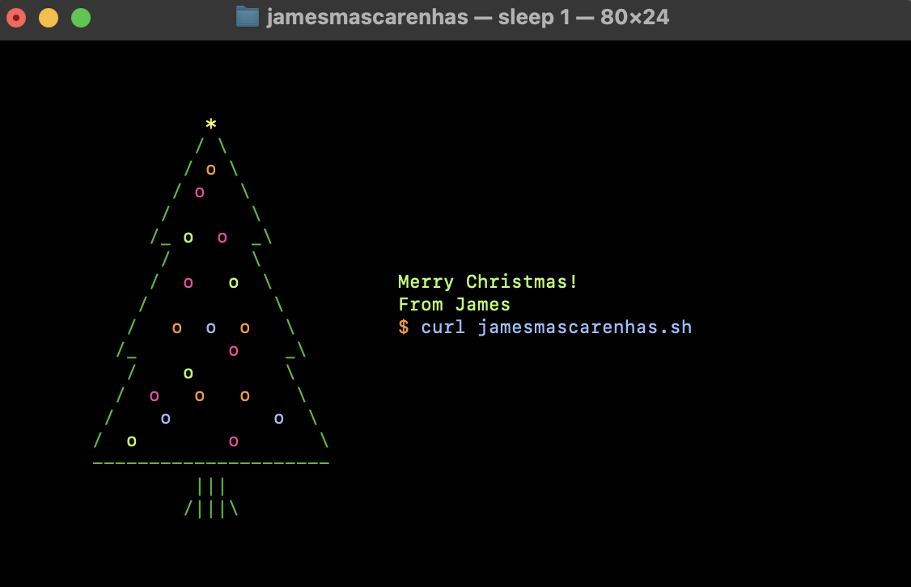

# Bash ascii-christmas-tree 🎄
Creating a Christmas Tree using Dave Eddy's Tutorial


## Usage  
Run it right now with 'curl':
```bash
curl https://raw.githubusercontent.com/JamesMascarenhas/ascii-christmas-tree/main/xmas_tree.sh | bash
```
Not yet hosted online, but can be used directly from the raw file URL
## Example
See how this program was written: https://www.youtube.com/watch?v=NENq-G2PsTo

## License
MIT License
